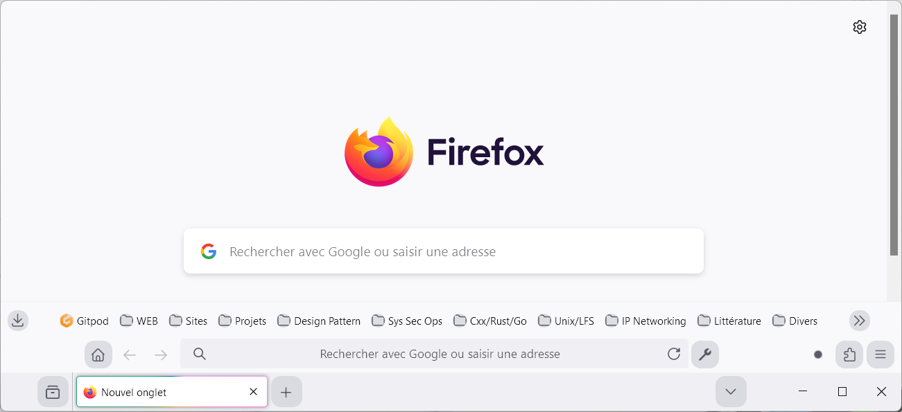
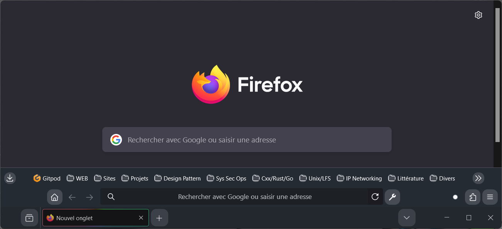
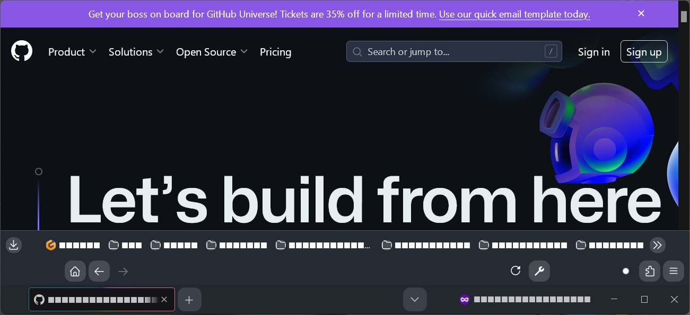

# Mozilla Firefox

Modification de certaines parties de l'UI de Firefox.

1. Ouvrir le navigateur Firefox
2. Se diriger vers la page d'URL `about:config`
3. Chercher `toolkit.legacyUserProfileCustomizations.stylesheets`
4. Activer cette configuration.
5. Se diriger vers la page d'URL `about:profiles`
6. Trouver le profil `default-release`, _répertoire racine_
7. Cliquer sur le bouton `Ouvrir le dossier` (FR)
8. Ouvrir le répertoire `chrome`
9. Copier tout le contenu du répertoire [chrome/\*](chrome/) de **CE dépôt GIT**
   à l'intérieur du répertoire `chrome` préalablement ouvert (point 8.)
10. Fermer toutes les instances du navigateur Firefox
11. Ouvrir le navigateur Firefox, admirer le changement

| Normal Browsing Mode                              | Private Browsing Mode                                                        |
| ------------------------------------------------- | ---------------------------------------------------------------------------- |
|  |                                                                              |
|    |  |
